**_You Matter_**

You Matter is a fictional gym which deals with your fitness and mental health, 
as you can’t have one without the other. 

The gym is targeted for all people and aims to help you with all your fitness 
needs by offering multiple classes. 

The gym also provides information and specilaised guidance to anyone 
struggling with mental health issues.
Welcome to your guide through You Matter <a href="https://jon9851.github.io/You-Matter-/" target="_blank" rel="noopner">You Matter</a>

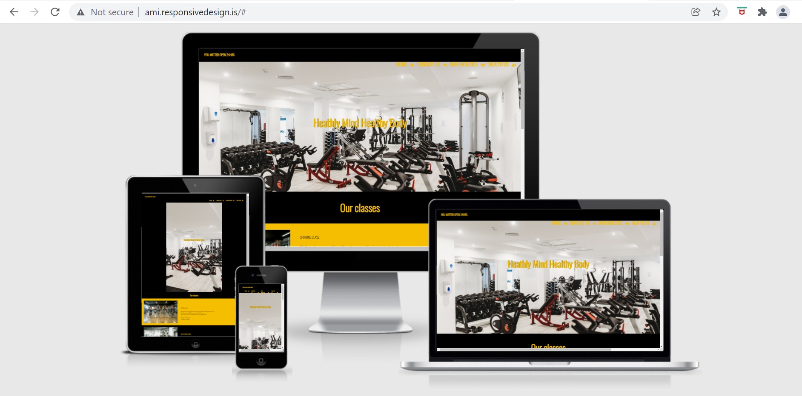

# Contents

* [**User Experience UX**](<#user-experience-ux>)
  * [Wireframes](<#wireframes>)
  * [Site Structure](<#site-structure>)
  * [Design Choices](<#design-choices>)
  * [Fonts used](<#Fonts>)
  * [Colour Scheme](<#colour-scheme>)
  * [**Features**](<#features>)
      * [Home](<#navigation-menu>)
      * [Navigation menu](<#navigation-menu>)
      * [Classes](<#classes>)
      * [Contact Button](<#contact>)
      * [Footer](<#footer>)
  * [**Contact**](<#contact>)
      * [Form](<#contact>)
  * [Facilities](<#facilities>)
      * [Gallery](<#facilities>)
  * [Talk to US](<#talk>)
      * [Images](<#talk-to-us>)
      * [Text](<#talk-to-us>)
      * [NHS Link](<#talk-to-us>)
* [**Future Features**](<#future-features>)
* [**Technologies Used**](<#technologies-used>)  
* [**Testing**](<#testing>)
* [**Bugs**](<#bugs>)
* [**Accessibilty**](<#accessibility>)
* [**Deployment**](<#deployment>)
* [**Credits**](<#credits>)
* [**Content**](<#content>)
* [**Media**](<#media>)
* [**Acknowledgements**](<#acknowledgements>)                

# User Experience (UX)

## Wireframes
The wireframes for ‘You Matter’ were produced in[Balsamiq](https://balsamiq.com).
There are frames for a full width display ( 1920 x 1080 )and a small mobile 
device (360 x 640). The final site varies slightly from the wireframes due to bugs and design 
changes during development that occurred during the creation process.
 

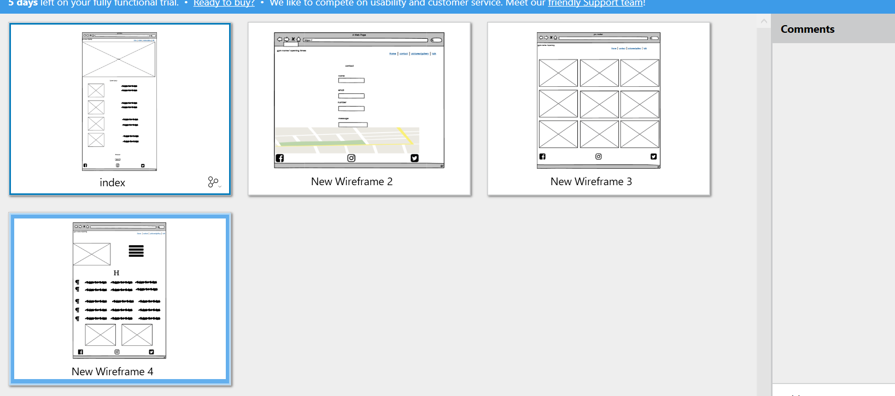
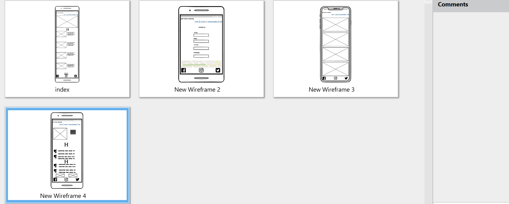

[Contents](<#contents>)

## Design Chocies

## Fonts
* The font that I chose was Oswald, due to its striking visual impact.

* I tested out several fonts which struggled on visibility with the overlay 
  on the nav bar. Oswald font worked and is used for all the text on the 
  pages.

* The style of ‘You Matter’ website was designed to be easy to follow 
  and use.

* The style of you matter was choosen for the simple design of the website which is easy to follow and use.

## Color Scheme 
* The colour scheme of black and yellow were eventually chosen for the 
site. Originally, the site was red and black, however this was changed 
due to the poor text visibility present on the pages. 

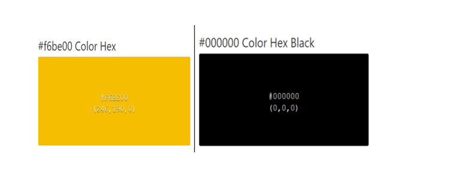

[Contents](<#contents>)

# Features
 The ‘You Matter’ site is designed for simplicity with easy to use features. The 
 site contains a navigation menu with an icon displayed next to the individual 
 pages names. 

 The site also contains a contact form with a message box and a gallery,
 displaying all the facilities the gym has to offer.

## Home
   ### Navigation Menu 
 
 * Situated at the top left of the site is the gym name and opening hours. 
   The navigation menu is located at the top right of the site.
 
 * The navigation menu includes four different links to the individual 
   pages of the site. All the links are fully functional.

*  The main backdrop images for the site feature gym equipment with 
   the text overlayed.

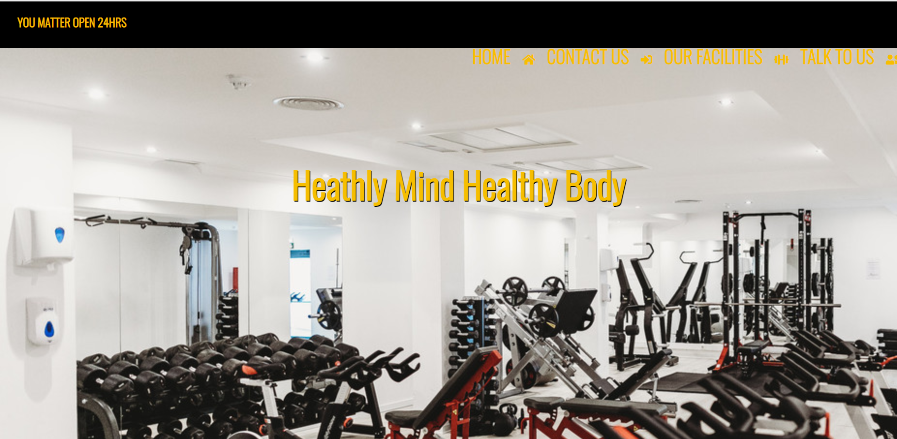

[Contents](<#contents>)

   
   ### Classes

  * The class section contains information about the different types of 
    classes that the gym has to offer. This includes a brief insight into the 
    classes as well as the potential rota. The text is situated on the right 
    hand side of the image.
  
  * Each class has a different photo to accompany the text information
   

 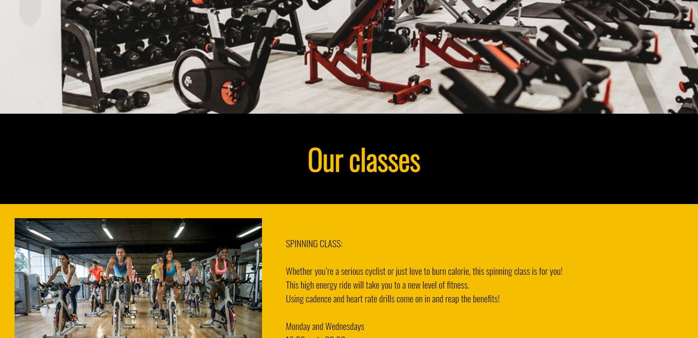  

  ### Contact Button
   
  * There is a contact button which directly link to the contacts page. The 
    button inkeeps with the idea to make the site user friendly.

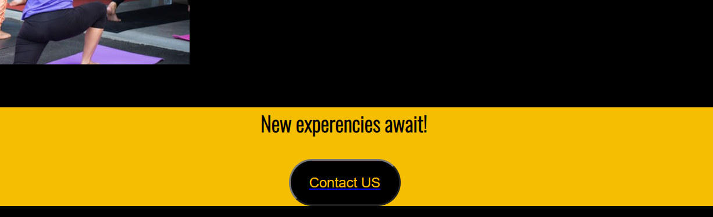
 
 [Contents](<#contents>)
### Footer
 
 * The footer on home, our facilities and talk pages just contain social media icons which are direct links to Facebook,Instagram and Twitter.
 
 * The footer on the contacts us page contains a map as well the social media icons included in the rest of the site.

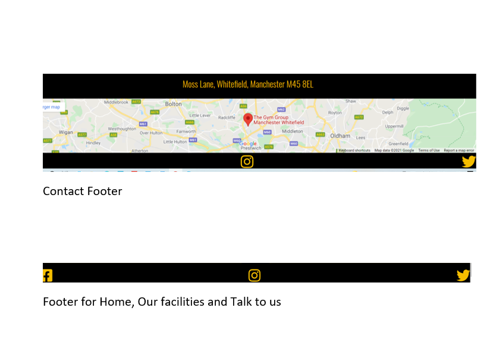

[Contents](<#contents>)

## Contact
  
  ### From 
   
   * The design for the contacts page on You Matter is simple and easy to 
     use. The page contains three input boxes and a message box. 
     Underneath the form box is a submit button which reloads the page 
     once the form has been filled in

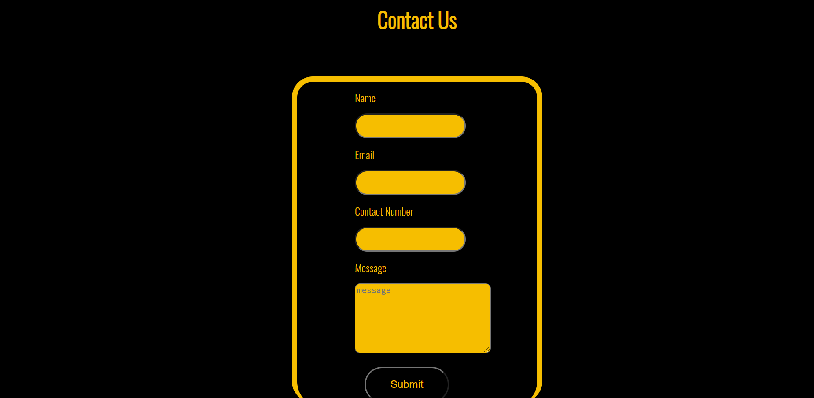

[Contents](<#contents>)
## Our facilities
 
 ### Gallery

   * ‘Our facilities’ section contains a different images on what facilities the 
      gym has to offer, as well as inspirational pictures. The pages contains 12 images.

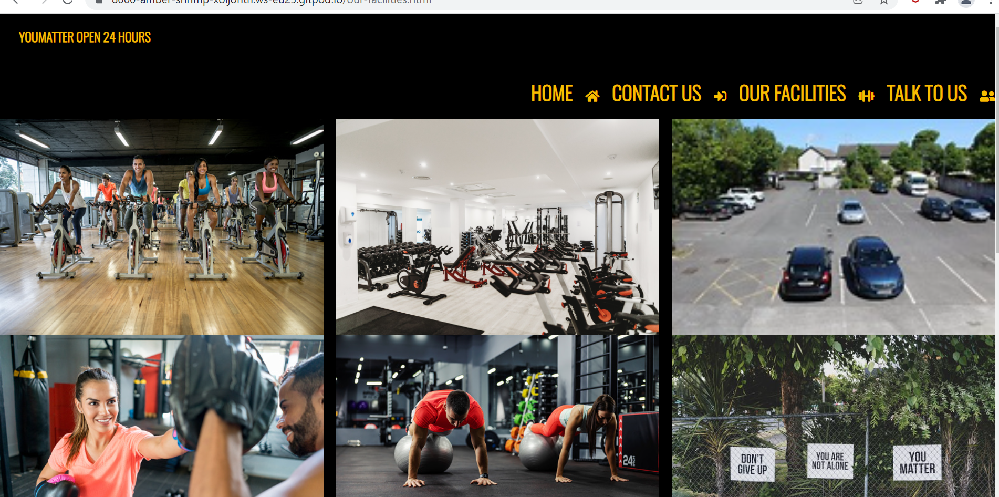 

## 'Talk to US'
  ### Images
   
   * ‘Talk to us’ page contains three images which are situated at the top 
left of the page and at the bottom. These images are designed to be welcoming.

  ### Text

   * The text at the top of the page is related to recovery plan concept and 
     provides information to the different steps.

   * The text on the rest of the page refer to two different types of mental health.

   ### NHS

   * Included in the page is a link to the NHS website which has more 
     information on the various types of mental health as well as further 
     information on the road to recovery.

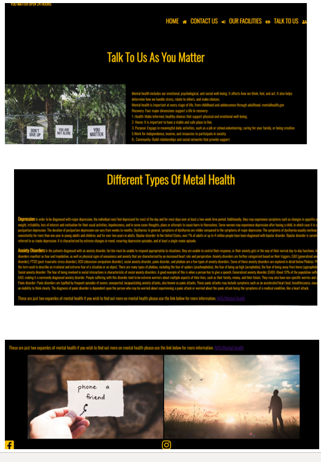

[Contents](<#contents>)
## Future Features

  * A personal trainers page with informations and workout plans.
  * A sign up page 
  * A video gallery page 

## Deployment

  ### **Deployment**

  The site was deployed using GitHub. THe following step will depoly You matter site.
  1. on the github repository, naviagte to **Settings** tab.
  2. Once on setting page, naviagte to **Pages** on the left hand side of the screen second from the bottom.
  3. Under **Source**, select the branch to **main**, then click **save**.
  4.  once you have selected the main branch, the page will be automatically refreshed with a detailed ribbon display to indicate the successful deployment. 
 
 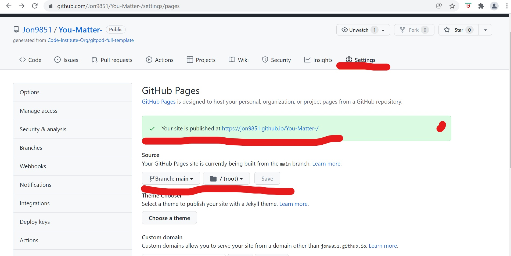
 
 # Technologies Used
   
* [HTML5](https://html.spec.whatwg.org/) -Used to create the contents and structure for the website.
* [CSS](https://www.w3.org/Style/CSS/Overview.en.html) -Used to create the styling.
* [Balsamiq](https://balsamiq.com/wireframes/) - Used to create the wireframes.
* [Gitpod](https://www.gitpod.io/#get-started) - Used to deploy the website.
* [Github](https://github.com/) - Used to host and edit the website code.

[Contents](<#contents>)

# Testing
 Please refer to [**_here_**](TESTING.md) for more information on testing 'You Matter'.

  
The live link will take you directly to **You Matter** repository - https://jon9851.github.io/You-Matter-/
  
  # Clone  Repository
   To Clone a repository use the following steps to guide you throught it.
   1. Under the repository’s name, click on the code tab.
   2. click on the clipboard icon to copy the given URL.
   3. In your IDE of choice, open Git Bash.
   4. Change the current working directory to the location where you want the cloned directory to be made.
   5. Type git clone, and then paste the URL copied from GitHub.
   6. Press enter and the local clone will be created.

   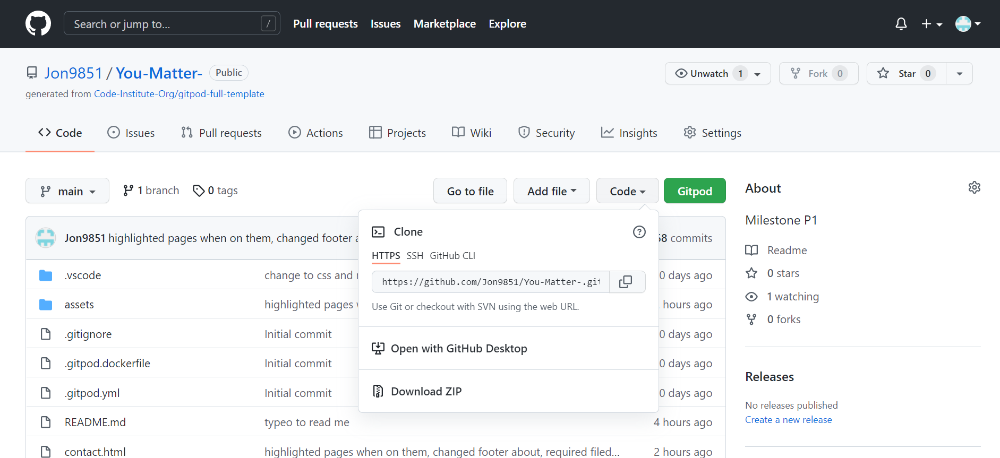

[Contents](<#contents>)

### Credits
* The font used came from [Google Fonts](https://fonts.google.com/).
* The map used is from [Google Maps](https://www.google.com/maps).
* Balsamiq was used to create the wireframes [Balsamiq](https://balsamiq.com/)
* Font Awesome was used for the icons on You Matter. [Font Awesome](https://fontawesome.com/)

### Media
   * Images used came from [unsplash](https://unsplash.com/)
   * Videos used came from [youtube](http://youtube.com)

[Contents](<#contents>)

# Acknowledgements
 
 The site was cerated for my milestone project 1 for the [Code Institute](https://codeinstitute.net/) Full Stack Software Developer diploma. I would like to thank all the tutors at the code institute for their help during the development of my first milestone project. I would aslo like to thank [Precious Ijege](https://www.linkedin.com/in/precious-ijege-908a00168/) for his guidence and help as his feedback was extremely key in completing my first milestone project.