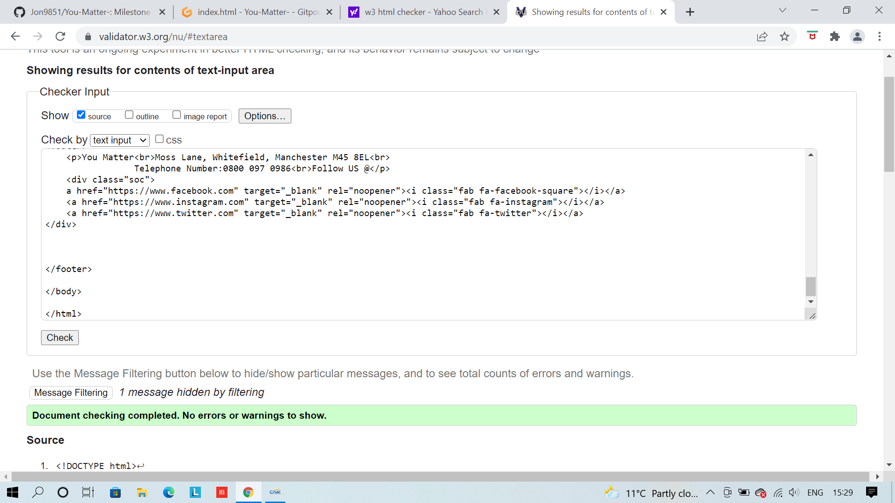

* [**Testing**](<#testing>)
* [**Bugs**](<#bugs>)
* [**Accessibilty**](<#accessibilty>)
# Testing
W3C markup validator and W3C CSS validator were used to test and vailidate all the code on all 4  pages on of You Matter to ensure that there were no syntax errors.

 # index
 The image below is testing for the index.html file. No errors or warnings are visable. 

 # Our Facilities
 The image below is testing for the our-facilities.html file. No errors or warnings are visable. 

 # Talk
 The image below is testing for the talk.html file. No errors or warnings are visable. 

 # Contact
 The image below is testing for the Contact.html file. No errors or warnings are visable. 

 # css 
 The image below is testing for the  style.css file. No errors or warnings are visable. 

 
# BUGS
The orginal design for you matter change a lot due to bugs and learning curves i faced during the development of this project. 

  1. Postion absoulte caused many issues when it came to my meida query moving everything out of alignment. I had to rewrite the code ,and remove postion abosulte from the source code.
  2. Button alignment on some the screen isn`t lined up correctly.
  3. Images size on tablet device doesn`t render with the correct width. Text goes out of alignnment on ipad. 
  4. During testing i had created a button inside a elemnet which caused errors during the validation so the code had to be rewritten.

# Accessibilty
Accessibilty was tested on lighthouse during the development of You Matter. The results are displayed below.

